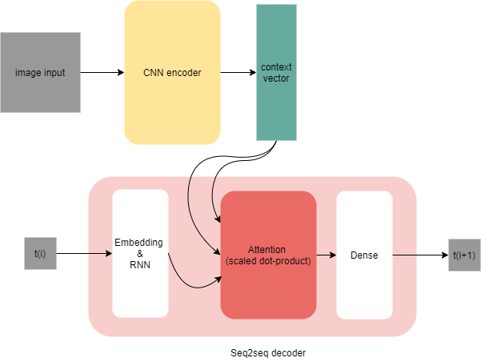

# Food recipe project

This is an ambitious project in which I intended to build an NLP model to achieve *image captioning* task. The model will recieve a food image as an input, and try to predict the step-by-step recipe to prepare the dish displayed in the input image while trying to improve model's generalization, not to force the model to memorize the recipes.

So, if this project was successful, we will have a machine learning model that know how to cook just by looking at the image. I proposed the model called `CNN-attention` which employ the attention machanism to adaptively select the useful information from image inputs. The model is a lot like [seq2seq with attention](https://www.tensorflow.org/text/tutorials/nmt_with_attention) where the different is that the encoder, instead of using RNN, uses the CNN to encode the information of images. The model architecture diagram is shown below.

- Python script for scrapping data from https://veenaazmanov.com is in `data/recipe-clawler.py`